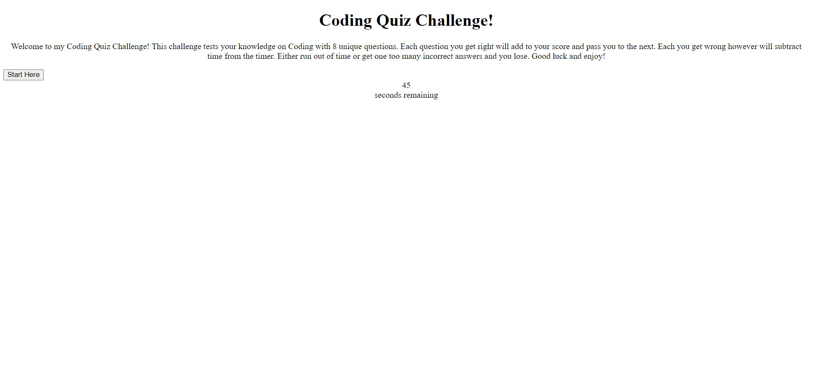
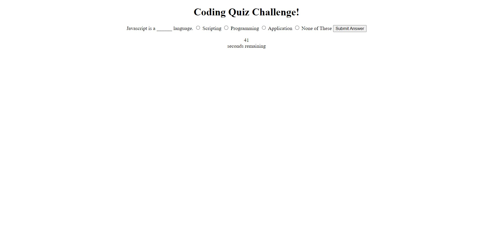

## Quiz Assigment
For our fourth homework assignment we were assigned to design a functioning quiz that had a timer that would decrease in time as you got an answer wrong and a score that would be saved and you can sign your initals to it. 
## Acceptance Criteria
GIVEN I am taking a code quiz
WHEN I click the start button
THEN a timer starts and I am presented with a question
WHEN I answer a question
THEN I am presented with another question
WHEN I answer a question incorrectly
THEN time is subtracted from the clock
WHEN all questions are answered or the timer reaches 0
THEN the game is over
WHEN the game is over
THEN I can save my initials and score
## Notes

## Screenshots

## Links
Repo : https://github.com/DewYourWorst/quiz-assignment
Live : https://dewyourworst.github.io/quiz-assignment/